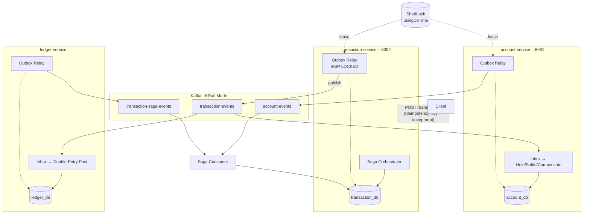
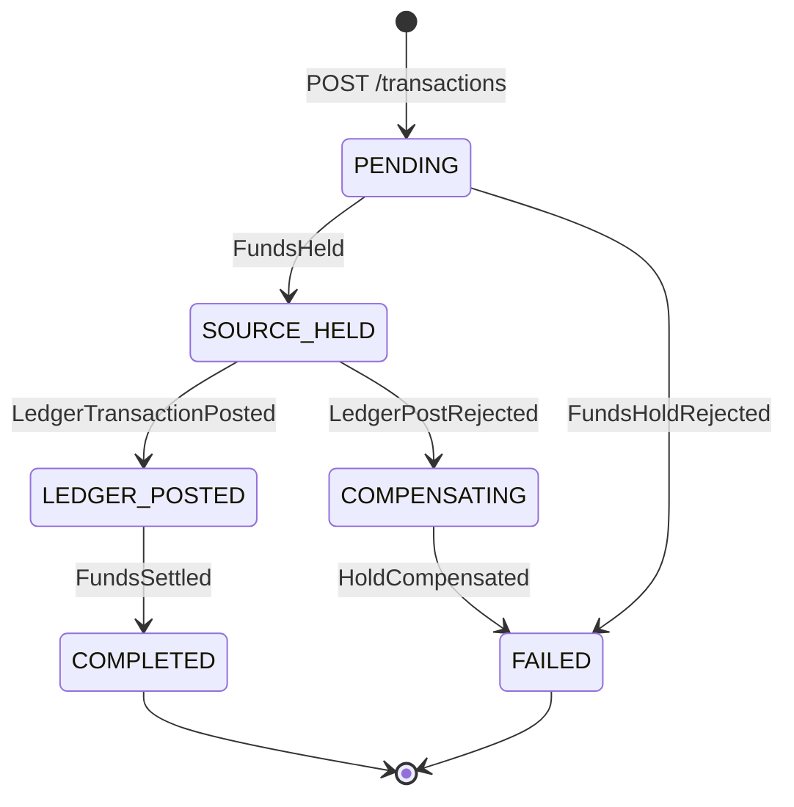

<div align="center">

# Distributed Financial Transaction Platform

**Zero-drift distributed money movement with provable financial invariants.**

Local ACID · Saga Choreography · Transactional Outbox/Inbox · Double-Entry Ledger · Cross-Service Reconciliation

---

[](https://openjdk.org/projects/jdk/21/)[](https://spring.io/projects/spring-boot)[](https://www.postgresql.org/)[-231F20?style=flat&logo=apachekafka&logoColor=white)](https://kafka.apache.org/)[](https://testcontainers.com/)

</div>

---

## Table of Contents

- [Why DFTP](#why-dftp)
- [Architecture](#architecture)
- [Core Invariants](#core-invariants)
- [Getting Started](#getting-started)
- [How It Works](#how-it-works)
  - [Saga Lifecycle](#saga-lifecycle)
  - [Outbox Engine](#outbox-engine)
  - [Distributed Coordination](#distributed-coordination)
  - [Trace Propagation](#trace-propagation)
- [Event Catalog](#event-catalog)
- [Architectural Decision Records](#architectural-decision-records)
- [Performance Profile](#performance-profile)
- [Resilience Matrix](#resilience-matrix)
- [Repository Layout](#repository-layout)
- [Production Deployment](#production-deployment)
- [Engineering Verification History](#engineering-verification-history)

---

## Why DFTP

Traditional distributed transaction protocols (XA / 2PC) fail in cloud environments. A coordinator crash while participants hold row locks cascades into indefinite connection starvation. Network partitions turn blocking coordinators into availability killers. Latency amplifies linearly with participant count.

DFTP takes a different approach. Instead of distributed locking, it composes **local ACID transactions**, **asynchronous Saga choreography**, and **Transactional Outbox/Inbox** to achieve distributed consistency without distributed locks:

| Concern | Mechanism |
| :--- | :--- |
| Atomicity across services | Choreographed Saga with deterministic state machine |
| Reliable event delivery | Transactional Outbox (`FOR UPDATE SKIP LOCKED`) |
| Duplicate suppression | Consumer Inbox (`INSERT ... ON CONFLICT DO NOTHING`) |
| Financial integrity | Append-only double-entry ledger with deferred balance triggers |
| Overdraft protection | PostgreSQL `CHECK` constraints on `settled_balance` and `held_funds` |
| Failure detection | Autonomous cross-service reconciliation scanner |
| Distributed coordination | ShedLock with `usingDbTime()` — zero external dependencies |
| Observability | W3C TraceContext propagated across HTTP → Outbox → Kafka → MDC |

The system is deliberately optimized for **financial correctness over theoretical throughput**.

---

## Architecture

Three bounded contexts, three autonomous databases, one Kafka event backbone.



Each service follows Hexagonal Architecture (Ports & Adapters):

```
com.dftp.<service>
  ├── api/             Inbound adapters: REST controllers, request DTOs
  ├── application/     Use cases, command handlers, Saga orchestration
  ├── domain/          Aggregates, entities, value objects (zero Spring dependencies)
  ├── infrastructure/  JPA entities, repositories, Flyway migrations
  └── messaging/       Kafka listeners, outbox relays, event serializers
```

---

## Core Invariants

Ten mathematical and financial rules enforced at the database engine level, not just application logic.

<table>
<thead><tr><th>#</th><th>Invariant</th><th>Enforcement</th></tr></thead>
<tbody>
<tr><td><b>1</b></td>
<td><b>Conservation of Funds</b><br/>∑ΔBalance = 0 across any closed system state</td>
<td>Double-entry ledger + deferred balance trigger</td></tr>

<tr><td><b>2</b></td>
<td><b>Non-Negative Balances</b><br/><code>settled_balance ≥ 0 ∧ held_funds ≥ 0</code></td>
<td>PostgreSQL <code>CHECK</code> constraints on <code>accounts</code> table</td></tr>

<tr><td><b>3</b></td>
<td><b>Double-Entry Equilibrium</b><br/>∑Debits − ∑Credits ≡ 0.0000 per posting group</td>
<td>Deferred trigger <code>ensure_ledger_balance</code> at commit + <code>UPDATE</code>/<code>DELETE</code> rejection triggers</td></tr>

<tr><td><b>4</b></td>
<td><b>Per-Account Causal Ordering</b><br/>FIFO processing per account</td>
<td>Deterministic Kafka partition key = <code>sourceAccountId</code></td></tr>

<tr><td><b>5</b></td>
<td><b>Hot Partition Salting</b><br/>High-volume accounts distributed across partitions</td>
<td><code>AccountPartitionStrategy</code> with bounded salt buckets</td></tr>

<tr><td><b>6</b></td>
<td><b>Exactly-Once Processing</b><br/>At-least-once transport + consumer deduplication</td>
<td>Outbox (write-side) + Inbox <code>INSERT ... ON CONFLICT DO NOTHING</code> (read-side)</td></tr>

<tr><td><b>7</b></td>
<td><b>Zero-Deadlock Outbox Scaling</b><br/>S<sub>i</sub> ∩ S<sub>j</sub> = ∅ ∀ i ≠ j</td>
<td>PostgreSQL <code>FOR UPDATE SKIP LOCKED</code> with 2-min stale claim recovery</td></tr>

<tr><td><b>8</b></td>
<td><b>Clock-Drift-Immune Coordination</b><br/>τ = PostgreSQL::NOW(), not container clock</td>
<td>ShedLock <code>usingDbTime()</code> — no Redis, no ZooKeeper</td></tr>

<tr><td><b>9</b></td>
<td><b>End-to-End Distributed Tracing</b><br/>Causality preserved across async boundaries</td>
<td><code>TraceContextPropagator</code>: HTTP → Outbox column → Kafka header → MDC</td></tr>

<tr><td><b>10</b></td>
<td><b>Reconciliation as Control Plane</b><br/>Detection ≠ remediation; ledger is authority</td>
<td><code>ReconciliationScannerService</code> — read-only drift detection, never auto-overwrites</td></tr>
</tbody>
</table>

---

## Getting Started

### Prerequisites

- **Java 21 LTS**
- **Docker & Docker Compose**
- **Maven 3.9+**

### Quick Start

```bash
# 1. Start PostgreSQL 16 + Kafka KRaft
docker compose up -d

# 2. Run the full test suite (Testcontainers — zero mocks at integration boundaries)
mvn clean verify

# 3. Start services (separate terminals)
mvn spring-boot:run -pl account-service
mvn spring-boot:run -pl transaction-service
mvn spring-boot:run -pl ledger-service
```

### Create a Transaction

```bash
curl -s -X POST http://localhost:8082/transactions \
  -H "Content-Type: application/json" \
  -H "Idempotency-Key: $(uuidgen)" \
  -H "traceparent: 00-4bf92f3577b34da6a3ce929d0e0e4736-00f067aa0ba902b7-01" \
  -d '{
    "sourceAccountId": "acc-source-001",
    "destinationAccountId": "acc-dest-002",
    "amount": 1500.00,
    "currency": "USD"
  }' | jq .
```

The Saga will asynchronously progress: `PENDING` → `SOURCE_HELD` → `LEDGER_POSTED` → `COMPLETED`.

### Verify

```bash
# Transaction status
curl -s http://localhost:8082/transactions/by-transaction-id/{txId} | jq .status

# Ledger journal entries
curl -s http://localhost:8083/ledger/transactions/by-transaction/{txId} | jq .

# Account balance
curl -s http://localhost:8081/accounts/{accountId} | jq .
```

> **Windows / Docker Engine 29+:** If Testcontainers fails with API negotiation errors, create `~/.docker-java.properties` with `api.version=1.44`.

---

## How It Works

### Saga Lifecycle



**`LEDGER_POSTED` is the financial pivot point.** Once the double-entry journal is committed, no automatic Saga rollback is permitted. Post-pivot failures require explicit compensating financial transactions through reconciliation — not silent state reversal.

**Two-Phase Fund Reservation.** Instead of direct debit-then-refund:

1. **Hold:** `heldFunds += amount` (available balance decreases, settled balance unchanged)
2. **Settle:** `heldFunds -= amount`, `settledBalance` adjusted for source and destination
3. **Compensate:** `heldFunds -= amount` (clean release, no overdraft possible)

The `CHECK` constraints guarantee that no concurrent interleaving of holds, settlements, or compensations can violate `settled_balance ≥ 0` or `held_funds ≥ 0`.

### Outbox Engine

Business state mutation and outbox event insertion share a single local ACID transaction. The relay operates in three phases:

```
 ┌─ Local ACID Tx ──────────────────────────────┐
 │  UPDATE aggregate SET status = 'SOURCE_HELD'  │
 │  INSERT INTO outbox_events (payload, status)  │
 └───────────────────────────────────────────────┘
                      ↓ commit
 ┌─ REQUIRES_NEW Tx ────────────────────────────────────────────────────────┐
 │  SELECT * FROM outbox_events                                             │
 │  WHERE status = 'PENDING'                                                │
 │     OR (status = 'CLAIMED' AND updated_at < NOW() - INTERVAL '2 MIN')   │
 │  ORDER BY created_at ASC LIMIT :batch                                    │
 │  FOR UPDATE SKIP LOCKED;                                                 │
 │                                                                          │
 │  UPDATE outbox_events SET status = 'CLAIMED'                             │
 └──────────────────────────────────────────────────────────────────────────┘
                      ↓
          KafkaTemplate.send(topic, key, payload)
          + traceparent injected as Kafka RecordHeader
                      ↓ ack (≤ 5s timeout)
 ┌─ Separate Tx ─────────────────────────────────┐
 │  UPDATE outbox_events SET status = 'PUBLISHED' │
 └────────────────────────────────────────────────┘
```

**Key design decision:** The database lock is released _before_ waiting for Kafka ACK. This prevents HikariCP connection starvation under broker latency spikes.

Serialization uses `ObjectMapper.writeValueAsString()` → `StringSerializer` → Kafka → `StringDeserializer` → `ObjectMapper.readValue()` — explicitly avoiding the double-serialization incident root-caused in Phase 06.10.

### Distributed Coordination

Background scheduled tasks (`ReconciliationScannerService`, `StalledSagaRecoveryService`, `DataRetentionPurgeService`) use **ShedLock** with `usingDbTime()`:

- Lock evaluation: `τ = PostgreSQL::NOW()`, independent of container clock (`tᵢ = τ + δᵢ`)
- No Redis, no ZooKeeper, no etcd — one Flyway-managed `shedlock` table in existing PostgreSQL
- Tested: 4 concurrent threads racing for a scheduled task → exactly 1 acquires the lock, 3 skip immediately

### Trace Propagation

W3C TraceContext Level-1 flows unbroken across asynchronous boundaries:

```
HTTP Request (traceparent header)
  → CorrelationIdFilter extracts/generates TraceMetadata
  → outbox_events.traceparent column (persisted in local ACID tx)
  → OutboxRelay injects as Kafka RecordHeader (UTF-8 bytes)
  → Consumer extracts header → SLF4J MDC (traceparent, traceId, spanId, correlationId)
```

Malformed `traceparent` headers are gracefully handled: `TraceContextPropagator` mints a valid new trace context and logs a warning.

---

## Event Catalog

All events are wrapped in `EventEnvelope<T>` with lineage metadata: `eventId`, `transactionId`, `correlationId`, `causationId`, `producerService`, `eventVersion`.

| Event | Producer | Consumer | Saga Transition |
| :--- | :--- | :--- | :--- |
| `FundsHoldRequested` | transaction | account | PENDING → hold funds |
| `FundsHeld` | account | transaction | → SOURCE_HELD |
| `FundsHoldRejected` | account | transaction | → FAILED |
| `LedgerPostRequested` | transaction | ledger | SOURCE_HELD → post journal |
| `LedgerTransactionPosted` | ledger | transaction | → LEDGER_POSTED |
| `LedgerPostRejected` | ledger | transaction | → COMPENSATING |
| `FundsSettlementRequested` | transaction | account | LEDGER_POSTED → settle |
| `FundsSettled` | account | transaction | → COMPLETED |
| `HoldCompensationRequested` | transaction | account | COMPENSATING → release |
| `HoldCompensated` | account | transaction | → FAILED |
| `AccountCreated` | account | transaction, ledger | Projection sync |

---

## Performance Profile

Measured under sustained burst load against real Testcontainers (PostgreSQL 16, Kafka 7.6.1):

<table>
<tr>
<td width="50%">

**Throughput & Latency**

| Metric | Value |
| :--- | ---: |
| Concurrent threads | 25 |
| Total transactions | 50 |
| Duration | 894 ms |
| **Throughput** | **55.93 TPS** |
| p50 latency | 601 ms |
| p95 latency | 744 ms |
| p99 latency | 760 ms |

</td>
<td width="50%">

**HikariCP Connection Pool**

| Metric | Value |
| :--- | ---: |
| Max pool size | 25 / pod |
| Peak active | 13 |
| Post-burst active | 0 |
| Post-burst idle | 13 |
| **Leaked connections** | **0** |
| **Pool exhaustion** | **0** |

</td>
</tr>
</table>

**Kafka Partition Balance** — 1,000 txns to a single hot merchant across 8 partitions:

```
Partition │  0  │  1  │  2  │  3  │  4  │  5  │  6  │  7  │
Messages  │ 124 │ 127 │ 126 │ 124 │ 125 │ 125 │ 124 │ 125 │
Share     │12.4%│12.7%│12.6%│12.4%│12.5%│12.5%│12.4%│12.5%│
```

Variance < 1.2% across all broker partitions.

---

## Resilience Matrix

Every scenario below was empirically validated with real Docker Testcontainers — not mocked.

| Failure Scenario | What Happens | Invariant |
| :--- | :--- | :---: |
| **Worker crash mid-outbox claim** | Stale claims expire (2 min); recovery sweep resets to `PENDING`; zero message loss | 6, 7 |
| **20 concurrent identical idempotency keys** | Exactly 1 insert (HTTP 201); rest receive HTTP 409; zero duplicate records | 6 |
| **25 concurrent debits, funds for 1** | Row lock serializes; 1 succeeds, 24 rejected; balance ≥ 0 | 1, 2 |
| **Kafka broker down 45s** | Outbox buffers locally; full flush on recovery; 0% data loss | 6 |
| **Container clock +5 min drift** | ShedLock queries `NOW()`; single-leader maintained; zero premature releases | 8 |
| **4 threads race for scheduled task** | Atomic DB update → 1 winner, 3 skip | 8 |
| **50 txns with pool restricted to 10** | HikariCP handles gracefully; 0 leaks; all complete in 894 ms | 2 |
| **Saga stalls after hold, before ledger** | Scanner detects timeout; automated compensation releases held funds | 1, 10 |
| **Malformed traceparent header** | New valid context minted; warning logged; transaction completes | 9 |
| **1,000 txns to single merchant** | Salted across 8 partitions (124–127 each); zero hot-spotting | 5 |

---

## Repository Layout

```
.
├── pom.xml                            Maven reactor (Spring Boot 3.3.3 parent)
├── docker-compose.yml                 PostgreSQL 16 + Kafka 7.6.1 KRaft
├── init-dbs.sql                       Creates account_db, transaction_db, ledger_db
│
├── common-infrastructure/             Shared foundational libraries
│   ├── event/                           EventEnvelope<T>, versioning
│   ├── inbox/                           InboxMessage, ON CONFLICT DO NOTHING
│   ├── outbox/                          OutboxEvent, OutboxRelay, SKIP LOCKED
│   ├── kafka/                           KafkaCommonConfig, DLT, StringSerializer
│   ├── observability/                   TraceContextPropagator, CorrelationIdFilter
│   └── db/migration-technical/          Flyway: outbox_events, inbox_messages
│
├── transaction-service/               Saga orchestrator
│   ├── api/                             REST API (:8082), idempotency
│   ├── application/                     State machine transitions
│   ├── domain/                          Transaction entity, @Version
│   ├── messaging/                       7 Saga event handlers
│   ├── settlement/                      Batch settlement (SKIP LOCKED)
│   └── reconciliation/                  Scanner, stalled Saga recovery
│
├── account-service/                   Account aggregate
│   ├── api/                             REST API (:8081)
│   ├── application/                     Hold / settle / compensate
│   ├── domain/                          Account, AccountOperation, CHECK constraints
│   └── messaging/                       4 event handlers
│
├── ledger-service/                    Double-entry general ledger
│   ├── application/                     @Transactional posting with deferred trigger
│   ├── domain/                          LedgerTransaction, Posting (DEBIT/CREDIT)
│   ├── messaging/                       Saga + account event consumers
│   └── db/migration/ledger/             Immutability triggers, balance constraints
│
├── e2e-tests/                         Testcontainers multi-service integration
├── service-template/                  Standardized service skeleton
├── deploy/k8s/                        Kubernetes: HPA, anti-affinity, probes, kustomize
├── scripts/                           DB maintenance: autovacuum, purge, reindex
├── docs/                              Architecture, ADRs, domain, security, operations
└── reports/                           Phase 00–14 audit reports
```

---

## Production Deployment

### Kubernetes (`deploy/k8s/`)

| Resource | Configuration |
| :--- | :--- |
| Namespaces & Secrets | PostgreSQL, Kafka SASL/SCRAM, JWT RSA credentials |
| Service Deployments | 3 replicas, readiness/liveness probes, pod anti-affinity |
| JVM Tuning | `-XX:+UseG1GC -XX:MaxRAMPercentage=75.0` |
| HPA | 3–10 pods on CPU (70%) + outbox lag |
| Deploy | `kubectl apply -k deploy/k8s` |

### Database Maintenance (`scripts/postgres-maintenance.sql`)

- Autovacuum tuning for `outbox_events`, `inbox_messages`, `shedlock` (scale factor 0.05)
- Bounded batch purge: `purge_archived_outbox_events`, `purge_aged_inbox_events`
- Concurrent reindex procedures and health monitoring views

---

<div align="center">
<sub>Distributed Financial Transaction Platform — engineered for the edge of chaos.</sub>
</div>
